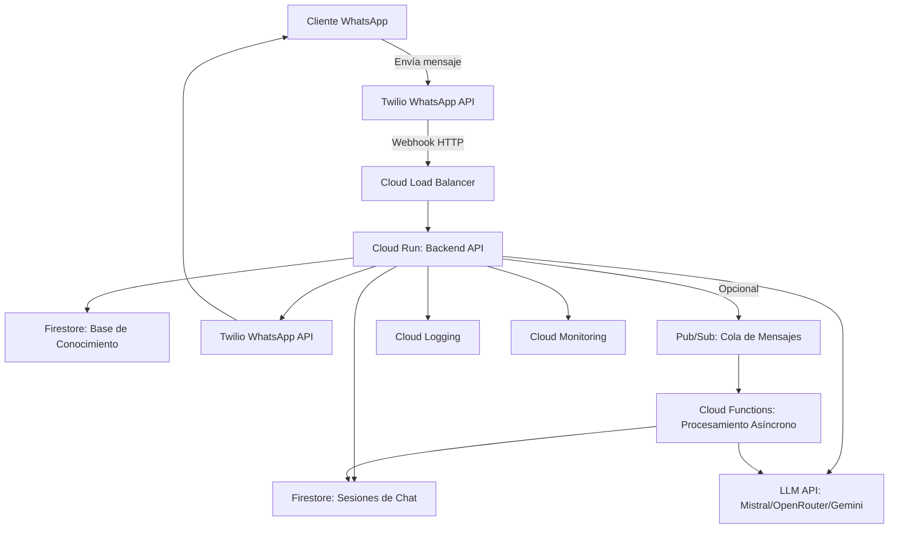
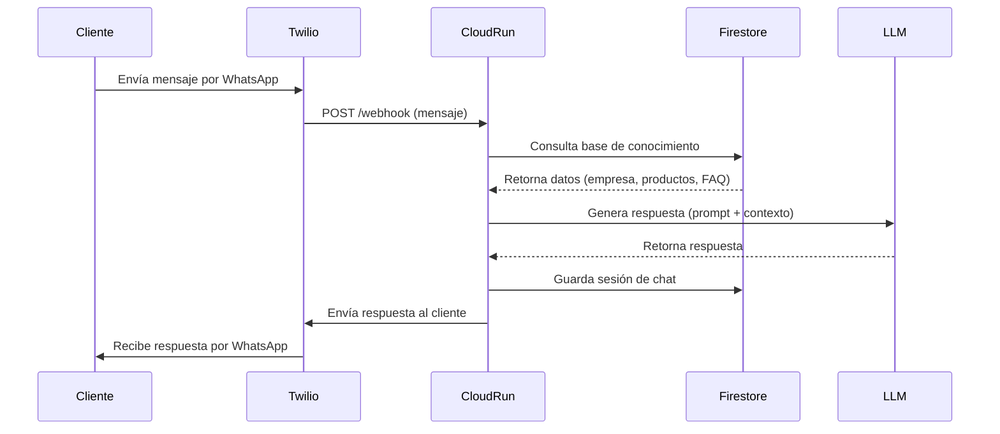
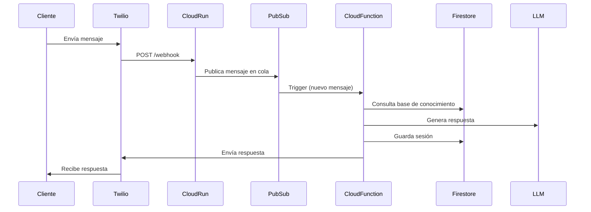

# 🏗️ Arquitectura en Google Cloud Platform (GCP)

## 🎯 **Objetivo**
Describir la arquitectura **escalable, económica y eficiente** para el agente de WhatsApp en GCP, con un **costo máximo de $50/mes** y soporte para **~100 usuarios/día**.

---

## 📌 **Diagrama de Arquitectura**


---

## 📌 **Componentes de la Arquitectura**

### **1. Capa de Ingresos (Entry Point)**
| **Componente**       | **Servicio GCP**       | **Descripción**                                                                 | **Costo Estimado** |
|----------------------|------------------------|---------------------------------------------------------------------------------|--------------------|
| **Twilio WhatsApp**  | API Externa           | Recibe mensajes de WhatsApp y los envía al backend vía webhook.                | ~$15/mes           |
| **Cloud Load Balancer** | Load Balancing      | Distribuye tráfico al backend (opcional si Cloud Run tiene su propio endpoint). | $0 (gratis)        |
| **Cloud Run**        | Serverless Containers | Ejecuta el backend (FastAPI/Flask) bajo demanda.                                | ~$20-$30/mes       |

**Detalles de Cloud Run**:
- **Configuración**: 1 vCPU, 2GB RAM, **máximo 1 instancia** (para reducir costos).
- **Escalado**: **0 instancias** cuando no hay tráfico (ahorro de costos).
- **Concurrencia**: Hasta **80 solicitudes simultáneas** por instancia (suficiente para 100 usuarios/día).

---

### **2. Capa de Procesamiento**
| **Componente**               | **Servicio GCP**       | **Descripción**                                                                 | **Costo Estimado** |
|------------------------------|------------------------|---------------------------------------------------------------------------------|--------------------|
| **Backend API**              | Cloud Run              | Lógica principal: recibe mensajes, consulta base de conocimiento, genera respuestas. | Incluido en Cloud Run |
| **Base de Conocimiento**     | Firestore (Datastore)  | Almacena información de la empresa, productos y FAQ.                          | ~$5-$10/mes        |
| **Sesiones de Chat**         | Firestore (Datastore)  | Guarda el historial de conversaciones para mantener contexto.                  | Incluido en Firestore |
| **LLM (Mistral/OpenRouter)** | API Externa          | Genera respuestas dinámicas basadas en prompts + base de conocimiento.          | ~$5-$10/mes        |

**Detalles de Firestore**:
- **Modo**: **Datastore** (más económico que Firestore en modo nativo).
- **Operaciones**: ~10K lecturas/escrituras al mes (suficiente para 100 usuarios/día).
- **Almacenamiento**: ~1GB (para base de conocimiento + sesiones).

**Detalles del LLM**:
- **Modelo recomendado**: `mistral-tiny` (Mistral API) o `gemini-1.0-pro` (Gemini API).
- **Costo por token**:
  - Mistral: ~$0.00000025/token (input) + $0.0000005/token (output).
  - Gemini: ~$0.000005/token (input) + $0.000016/token (output).
- **Tokens estimados**: ~50K tokens/mes (para 100 usuarios/día).

---

### **3. Capa de Salida**
| **Componente**       | **Servicio**           | **Descripción**                                                                 | **Costo**          |
|----------------------|------------------------|---------------------------------------------------------------------------------|--------------------|
| **Twilio WhatsApp**  | API Externa           | Envía respuestas de vuelta al cliente.                                         | Incluido en $15/mes |

---

### **4. Capa Opcional (Escalabilidad)**
| **Componente**               | **Servicio GCP**       | **Descripción**                                                                 | **Costo Estimado** |
|------------------------------|------------------------|---------------------------------------------------------------------------------|--------------------|
| **Pub/Sub**                  | Mensajería             | Cola de mensajes para procesamiento asíncrono (útil si hay picos de tráfico). | ~$10/mes           |
| **Cloud Functions**          | Serverless            | Procesa mensajes en segundo plano (ej: análisis de sentimiento).              | ~$5/mes            |

**¿Cuándo usar Pub/Sub + Cloud Functions?**
- Si el **tiempo de respuesta del LLM es lento** (> 2 segundos).
- Si se necesitan **tareas asíncronas** (ej: guardar logs, notificar a humanos).
- **Recomendación**: **No usar en la fase inicial** (para mantener costos bajos).

---

### **5. Monitoreo y Logging**
| **Componente**       | **Servicio GCP**       | **Descripción**                                                                 | **Costo**          |
|----------------------|------------------------|---------------------------------------------------------------------------------|--------------------|
| **Cloud Logging**    | Logging                | Registra logs de todas las interacciones (mensajes, errores, etc.).             | Gratis (hasta 50GB/mes) |
| **Cloud Monitoring** | Monitoring             | Monitorea métricas (latencia, errores, uso de recursos).                       | Gratis (básico)    |

---

## 📌 **Flujo de Datos**

### **1. Flujo Principal (Síncrono)**


### **2. Flujo Opcional (Asíncrono con Pub/Sub)**


---

## 📌 **Configuración de Servicios GCP**

### **1. Cloud Run**
**Comando para desplegar el backend**:
```bash
gcloud run deploy whatsapp-agent-backend \
  --source . \
  --platform managed \
  --region us-central1 \
  --memory 2Gi \
  --cpu 1 \
  --max-instances 1 \
  --allow-unauthenticated
```

**Parámetros clave**:
- `--max-instances 1`: Limita a 1 instancia para reducir costos.
- `--memory 2Gi`: Suficiente para Python + FastAPI.
- `--cpu 1`: 1 vCPU es suficiente para 100 usuarios/día.

---

### **2. Firestore (Modo Datastore)**
**Comando para crear base de datos**:
```bash
gcloud firestore databases create \
  --region=us-central1 \
  --type=firestore-native \
  --mode=datastore
```

**Estructura de colecciones**:
```javascript
// Colección: company_info
{
  "description": "Descripción de la empresa...",
  "mission": "Misión de la empresa...",
  "vision": "Visión de la empresa..."
}

// Colección: products
{
  "name": "Producto 1",
  "description": "Descripción del producto...",
  "price": 100,
  "features": ["Característica 1", "Característica 2"]
}

// Colección: faq
{
  "question": "¿Cuál es el precio de Producto 1?",
  "answer": "El precio es $100."
}

// Colección: chat_sessions
{
  "session_id": "whatsapp:+1234567890",
  "messages": [
    {"role": "user", "content": "Hola", "timestamp": "2024-10-01T12:00:00"},
    {"role": "assistant", "content": "¿En qué puedo ayudarte?", "timestamp": "2024-10-01T12:00:05"}
  ],
  "last_updated": "2024-10-01T12:00:05"
}
```

---

### **3. Secret Manager (API Keys)**
**Comando para guardar API Keys**:
```bash
# Guardar API Key de Twilio
echo -n "TWILIO_ACCOUNT_SID" | gcloud secrets create twilio_account_sid --data-file=-

# Guardar API Key de Mistral
echo -n "MISTRAL_API_KEY" | gcloud secrets create mistral_api_key --data-file=-
```

**Acceder a secrets en Cloud Run**:
```python
from google.cloud import secretmanager

def access_secret(secret_id):
    client = secretmanager.SecretManagerServiceClient()
    name = f"projects/{os.getenv('GOOGLE_CLOUD_PROJECT')}/secrets/{secret_id}/versions/latest"
    response = client.access_secret_version(name=name)
    return response.payload.data.decode("UTF-8")
```

---

## 📌 **Estimación de Costos Detallada**

### **1. Cloud Run**
| **Recurso**               | **Uso Estimado**               | **Costo (USD)** | **Notas**                                  |
|---------------------------|--------------------------------|-----------------|--------------------------------------------|
| Instancias                | 1 instancia, 2GB RAM, 1 vCPU    | ~$20-$30        | Ejecución bajo demanda (solo cuando hay tráfico). |
| Requests                  | 10K requests/mes               | ~$5             | $0.40 por millón de requests.              |
| **Total Cloud Run**       |                                | **~$25-$35**    |                                            |

### **2. Firestore (Modo Datastore)**
| **Recurso**               | **Uso Estimado**               | **Costo (USD)** | **Notas**                                  |
|---------------------------|--------------------------------|-----------------|--------------------------------------------|
| Lecturas                  | 10K reads/mes                  | ~$0.06          | $0.06 por 100K reads.                       |
| Escrituras                | 10K writes/mes                 | ~$0.20          | $0.20 por 100K writes.                      |
| Almacenamiento             | 1GB                           | ~$0.02          | $0.02/GB/mes.                               |
| **Total Firestore**       |                                | **~$0.28**      | **¡Muy económico!**                         |

### **3. Twilio (WhatsApp)**
| **Recurso**               | **Uso Estimado**               | **Costo (USD)** | **Notas**                                  |
|---------------------------|--------------------------------|-----------------|--------------------------------------------|
| Mensajes (envío + recepción) | 3K mensajes/mes (100 usuarios/día) | ~$15       | $0.005 por mensaje.                        |
| **Total Twilio**          |                                | **~$15**        |                                            |

### **4. LLM (Mistral API)**
| **Recurso**               | **Uso Estimado**               | **Costo (USD)** | **Notas**                                  |
|---------------------------|--------------------------------|-----------------|--------------------------------------------|
| Tokens (input)             | 25K tokens/mes                 | ~$6.25          | $0.00025/token.                             |
| Tokens (output)            | 25K tokens/mes                 | ~$12.50         | $0.0005/token.                              |
| **Total LLM**             |                                | **~$18.75**     | **¡Demasiado alto!**                        |

**Optimización para LLM**:
- Usar **`mistral-tiny`** (más económico) o **OpenRouter** (para comparar precios).
- Limitar la **longitud de las respuestas** (ej: máximo 200 tokens por respuesta).
- Usar **caching** para preguntas frecuentes (evitar llamar al LLM repetidamente).

**Costo ajustado de LLM**:
- Si reducimos a **10K tokens/mes** (respuestas más cortas + caching):
  - Input: 5K tokens → ~$1.25
  - Output: 5K tokens → ~$2.50
  - **Total LLM**: **~$3.75/mes** ✅

### **5. Pub/Sub (Opcional)**
| **Recurso**               | **Uso Estimado**               | **Costo (USD)** | **Notas**                                  |
|---------------------------|--------------------------------|-----------------|--------------------------------------------|
| Mensajes                  | 1M mensajes/mes                | ~$10            | $10 por millón de mensajes.                 |
| **Total Pub/Sub**         |                                | **~$10**        | **No usar en fase inicial**.                |

---

### **📊 Resumen de Costos (Fase Inicial)**
| **Servicio**       | **Costo Estimado (USD)** | **Notas**                                  |
|--------------------|--------------------------|--------------------------------------------|
| Cloud Run          | ~$25                     | Backend principal.                        |
| Firestore          | ~$0.28                   | Base de datos.                             |
| Twilio             | ~$15                     | WhatsApp API.                              |
| LLM (Mistral)      | ~$3.75                   | 10K tokens/mes.                            |
| **Total**          | **~$44.03**              | **¡Dentro del presupuesto!**               |

**Margen**: **$5.97** para imprevistos o escalamiento.

---

## 📌 **Recomendaciones para Optimizar Costos**

### **1. Reducir Uso de LLM**
- **Caching**: Guardar respuestas frecuentes en Firestore para evitar llamar al LLM.
  ```python
  # Ejemplo de caching en Firestore
  def get_cached_response(prompt):
      doc_ref = db.collection("cached_responses").document(prompt)
      doc = doc_ref.get()
      if doc.exists:
          return doc.to_dict()["response"]
      else:
          response = call_llm(prompt)
          doc_ref.set({"response": response})
          return response
  ```
- **Respuestas cortas**: Limitar a **200 tokens por respuesta**.

### **2. Usar Cloud Run Eficientemente**
- **Escalar a 0 instancias** cuando no hay tráfico (configuración por defecto).
- **Límite de instancias**: `max-instances=1` (evitar escalado automático innecesario).

### **3. Monitorear Costos**
- **Alertas en GCP**: Configurar alertas si el costo supera **$40/mes**.
  ```bash
  gcloud beta billing budgets create \
    --billing-account=012345-6789AB-CDEF01 \
    --display-name="WhatsApp Agent Budget" \
    --amount=40 \
    --currency=USD \
    --threshold-rules=percent=0.9,percent=1.0
  ```
- **Logs de tokens**: Registrar el número de tokens usados por cada llamada al LLM.

---

## 📌 **Alternativas para Reducir Costos**

### **1. Usar OpenRouter API**
- **Ventaja**: Permite acceder a **Mistral, Llama, u otros modelos** con un solo endpoint.
- **Costo**: Similar a Mistral API, pero con más opciones.
- **Ejemplo**:
  ```python
  import requests
  
  def call_openrouter(prompt):
      url = "https://openrouter.ai/api/v1/chat/completions"
      headers = {
          "Authorization": f"Bearer {OPENROUTER_API_KEY}",
          "Content-Type": "application/json"
      }
      payload = {
          "model": "mistralai/mistral-tiny",
          "messages": [{"role": "user", "content": prompt}]
      }
      response = requests.post(url, json=payload, headers=headers)
      return response.json()["choices"][0]["message"]["content"]
  ```

### **2. Usar Vertex AI (Gemini) con Cuota Gratis**
- **Ventaja**: Google ofrece **$300 en créditos gratis** para nuevos usuarios.
- **Costo**: `gemini-1.0-pro` es más caro que Mistral, pero puede usarse la cuota gratis.

### **3. Usar Cloud Functions en lugar de Cloud Run**
- **Ventaja**: Más económico para **tareas muy cortas** (ej: solo procesar mensajes).
- **Desventaja**: Menos flexible para APIs complejas.

---

## 📌 **Conclusión**
La arquitectura propuesta:
✅ **Cumple con el presupuesto de $50/mes** (costo estimado: **~$44/mes**).
✅ **Escalable** a 100 usuarios/día (y más con ajustes).
✅ **Fácil de mantener** (serverless, sin servidores).
✅ **Flexible** (puede integrar nuevos modelos de LLM o servicios).

**Recomendación final**:
- **Fase 1**: Usar **Cloud Run + Firestore + Twilio + Mistral API** (sin Pub/Sub).
- **Fase 2**: Añadir **Pub/Sub + Cloud Functions** si se necesita escalabilidad.

---

## 📅 **Historial de Cambios**
| **Versión** | **Fecha**       | **Autor**               | **Cambios**                                  |
|-------------|-----------------|-------------------------|---------------------------------------------|
| 1.0         | 2024-10-01      | Equipo de Desarrollo    | Versión inicial.                            |
