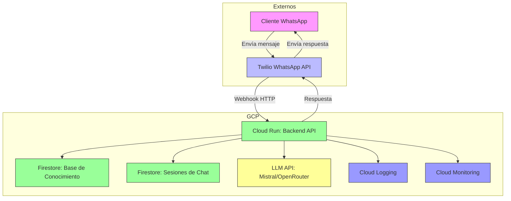
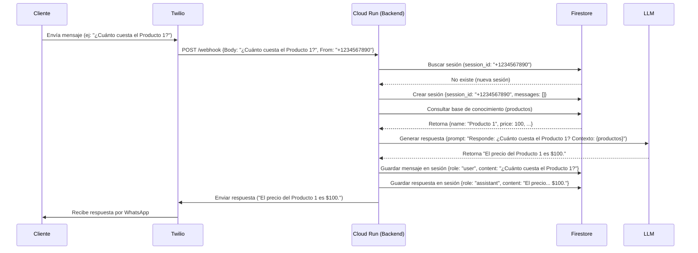
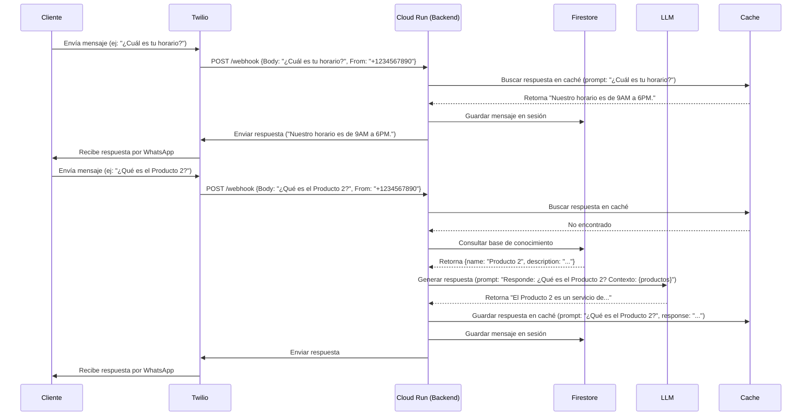
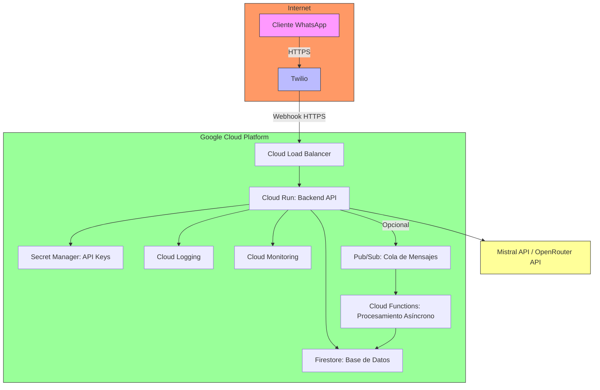
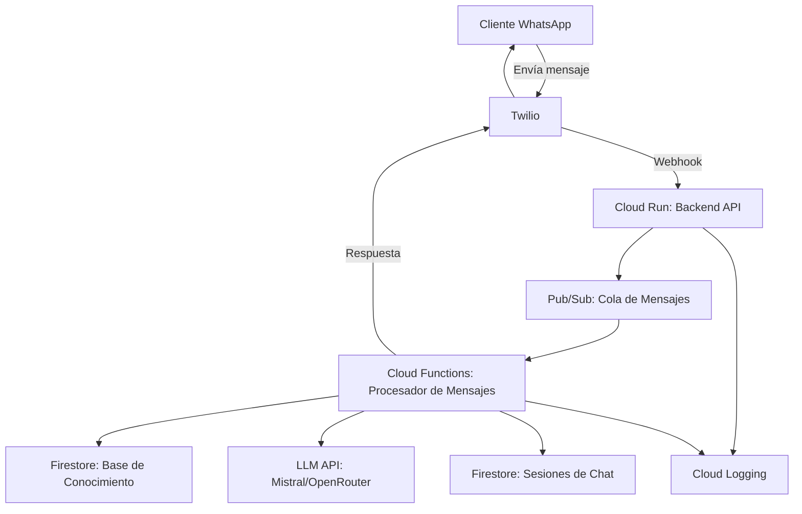
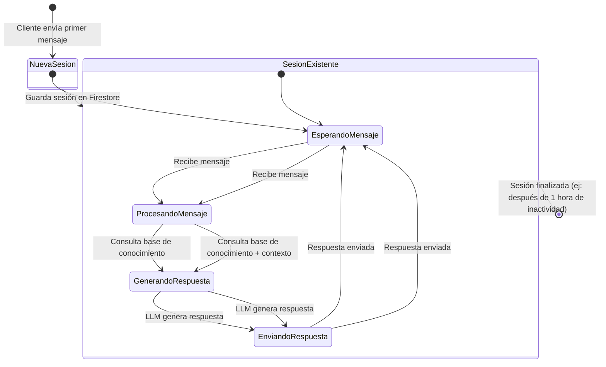
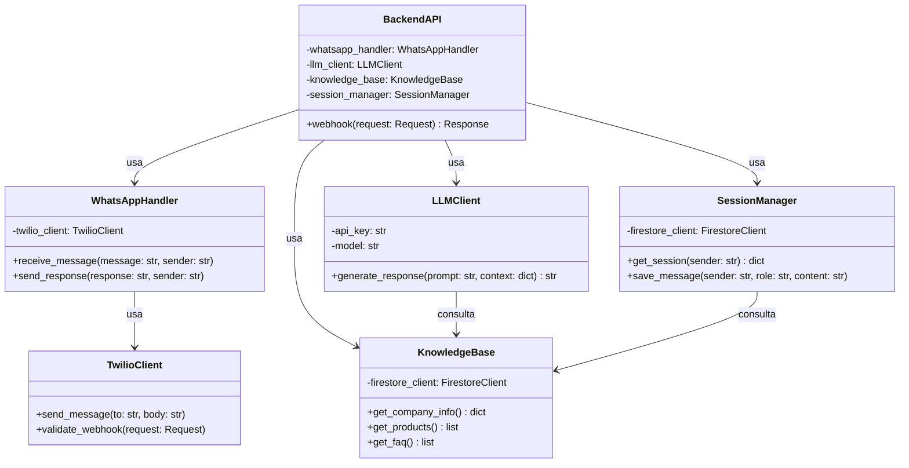

# 🏗️ Diagrama de Arquitectura - Agente de WhatsApp

## 🎯 **Objetivo**
Este documento contiene los **diagramas visuales** de la arquitectura del agente de WhatsApp, incluyendo:
1. **Diagrama de componentes** (visión general).
2. **Diagrama de flujo de datos** (cómo interactúan los componentes).
3. **Diagrama de secuencia** (detalle de las interacciones).
4. **Diagrama de despliegue** (infraestructura en GCP).

---

## 📌 **1. Diagrama de Componentes (Visión General)**


**Leyenda**:
- **Rosa (A)**: Usuario final (WhatsApp).
- **Azul (B)**: Servicio externo (Twilio).
- **Verde (C, D, E)**: Servicios en GCP.
- **Amarillo (F)**: API externa (LLM).
- **Morado (G, H)**: Monitoreo.

---

## 📌 **2. Diagrama de Flujo de Datos**
```mermaid
flowchart TD
    %% --- Entrada ---
    A[Cliente envía mensaje por WhatsApp] --> B[Twilio recibe mensaje]
    
    %% --- Procesamiento en GCP ---
    B --> C[Cloud Run: Backend API]
    C --> D{¿Es un mensaje nuevo?}
    D -->|Sí| E[Crear nueva sesión en Firestore]
    D -->|No| F[Recuperar sesión existente]
    
    C --> G[Consultar base de conocimiento en Firestore]
    C --> H[Generar respuesta con LLM]
    H --> I{¿Respuesta válida?}
    I -->|Sí| J[Enviar respuesta a Twilio]
    I -->|No| K[Notificar a humano (opcional)]
    
    %% --- Salida ---
    J --> L[Twilio envía respuesta a cliente]
    L --> A
    
    %% --- Almacenamiento ---
    C --> M[Guardar mensaje en Firestore]
    J --> M
    
    %% --- Estilos ---
    style A fill:#f9f,stroke:#333
    style B fill:#bbf,stroke:#333
    style C fill:#9f9,stroke:#333
    style D fill:#ff9,stroke:#333
    style E fill:#9f9,stroke:#333
    style F fill:#9f9,stroke:#333
    style G fill:#9f9,stroke:#333
    style H fill:#ff9,stroke:#333
    style I fill:#ff9,stroke:#333
    style J fill:#9f9,stroke:#333
    style K fill:#f99,stroke:#333
    style L fill:#bbf,stroke:#333
    style M fill:#9f9,stroke:#333
```

**Descripción**:
1. El cliente envía un mensaje por WhatsApp.
2. Twilio recibe el mensaje y lo envía al backend en Cloud Run.
3. El backend:
   - Crea o recupera una sesión de chat en Firestore.
   - Consulta la base de conocimiento (empresa, productos, FAQ).
   - Genera una respuesta usando el LLM.
   - Valida la respuesta y la envía de vuelta al cliente.
4. El mensaje y la respuesta se guardan en Firestore para mantener contexto.

---

## 📌 **3. Diagrama de Secuencia (Flujo Principal)**


**Notas**:
- **Firestore** se usa para:
  - Guardar **sesiones de chat** (contexto de la conversación).
  - Almacenar la **base de conocimiento** (empresa, productos, FAQ).
- **LLM** recibe un **prompt** con el mensaje del usuario + contexto de la base de conocimiento.

---

## 📌 **4. Diagrama de Secuencia (Flujo con Caching)**


**Ventaja del caching**:
- **Reduce costos de LLM**: Evita llamar al LLM para preguntas frecuentes.
- **Mejora velocidad**: Respuestas instantáneas para preguntas en caché.

---

## 📌 **5. Diagrama de Despliegue (Infraestructura en GCP)**


**Descripción**:
- **Cloud Load Balancer**: Distribuye tráfico al backend (opcional si Cloud Run tiene su propio endpoint público).
- **Cloud Run**: Ejecuta el backend (FastAPI/Flask) en un contenedor.
- **Firestore**: Almacena base de conocimiento y sesiones de chat.
- **Secret Manager**: Guarda API keys (Twilio, Mistral, etc.).
- **Pub/Sub + Cloud Functions**: Opcional para procesamiento asíncrono (ej: notificaciones a humanos).

---

## 📌 **6. Diagrama de Arquitectura Alternativa (Con Pub/Sub)**


**¿Cuándo usar esta arquitectura?**
- Si el **procesamiento del LLM es lento** (> 2 segundos).
- Si se necesitan **tareas asíncronas** (ej: notificar a humanos, guardar logs).
- **Desventaja**: Aumenta el costo (~$10/mes adicionales por Pub/Sub + Cloud Functions).

---

## 📌 **7. Diagrama de Estados (Sesión de Chat)**


**Descripción**:
- **NuevaSesion**: Se crea cuando un cliente envía su **primer mensaje**.
- **SesionExistente**: Se recupera el contexto de mensajes anteriores.
- **Contexto**: El LLM recibe el **historial de la sesión** para generar respuestas coherentes.

---

## 📌 **8. Diagrama de Clases (Backend)**


**Descripción**:
- **BackendAPI**: Punto de entrada (FastAPI/Flask).
- **WhatsAppHandler**: Maneja mensajes entrantes/salientes con Twilio.
- **LLMClient**: Genera respuestas usando Mistral/OpenRouter.
- **KnowledgeBase**: Accede a Firestore para obtener información de la empresa.
- **SessionManager**: Guarda y recupera sesiones de chat en Firestore.

---

## 📌 **Resumen de Diagramas**
| **Tipo de Diagrama**       | **Propósito**                                                                 | **Ubicación**                          |
|----------------------------|------------------------------------------------------------------------------|----------------------------------------|
| Componentes                | Visión general de los componentes del sistema.                            | [Arriba](#1-diagrama-de-componentes-visión-general) |
| Flujo de Datos             | Cómo fluyen los datos entre componentes.                                    | [Arriba](#2-diagrama-de-flujo-de-datos) |
| Secuencia (Principal)      | Detalle de las interacciones en el flujo principal.                        | [Arriba](#3-diagrama-de-secuencia-flujo-principal) |
| Secuencia (Con Caching)    | Flujo optimizado con caching para preguntas frecuentes.                   | [Arriba](#4-diagrama-de-secuencia-flujo-con-caching) |
| Despliegue                 | Infraestructura en GCP.                                                      | [Arriba](#5-diagrama-de-despliegue-infraestructura-en-gcp) |
| Arquitectura Alternativa   | Versión con Pub/Sub para escalabilidad.                                      | [Arriba](#6-diagrama-de-arquitectura-alternativa-con-pubsub) |
| Estados                    | Estados de una sesión de chat.                                                | [Arriba](#7-diagrama-de-estados-sesión-de-chat) |
| Clases                     | Estructura del código backend.                                               | [Arriba](#8-diagrama-de-clases-backend) |

---

## 📌 **Herramientas para Generar Diagramas**
Si necesitas editar estos diagramas:
1. **Mermaid Live Editor**: [https://mermaid.live/](https://mermaid.live/) (para probar cambios en tiempo real).
2. **VS Code + Extensión Mermaid**: Para visualizar diagramas directamente en el editor.
3. **Draw.io**: Para diagramas más complejos (exportar a PNG/SVG).

---

## 📅 **Historial de Cambios**
| **Versión** | **Fecha**       | **Autor**               | **Cambios**                                  |
|-------------|-----------------|-------------------------|---------------------------------------------|
| 1.0         | 2024-10-01      | Equipo de Desarrollo    | Versión inicial con todos los diagramas.    |
