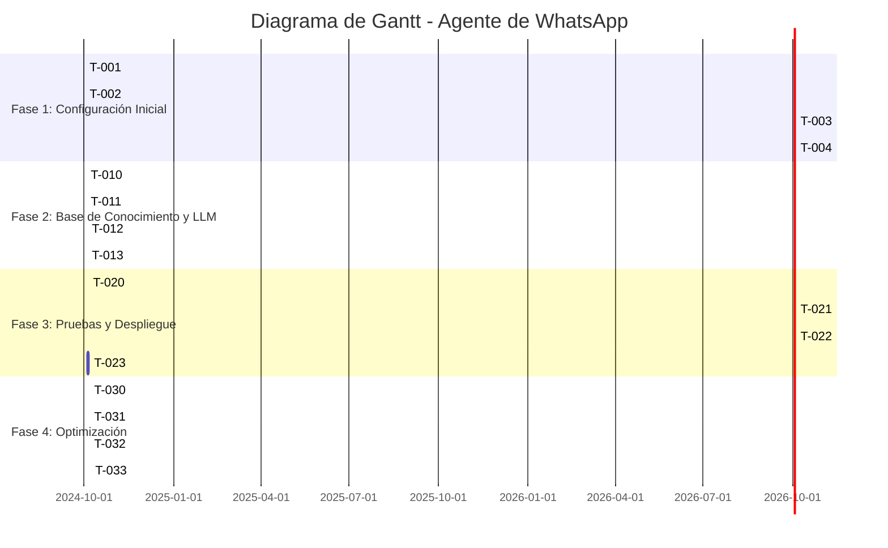

# 📜 Plan Maestro - Agente de WhatsApp para Servicio al Cliente y Ventas

## 🎯 **Resumen Ejecutivo**
Este documento describe el **plan detallado** para desarrollar un **agente de WhatsApp** que automatice el **servicio al cliente y ventas**, utilizando **Mistral API**, **Gemini API** o **OpenRouter API** como modelos de lenguaje. El sistema estará desplegado en **Google Cloud Platform (GCP)** con un **costo máximo de $50/mes** y soportará **~100 usuarios/día**.

---

## 📌 **Objetivos del Proyecto**

### **Objetivo Principal**
Desarrollar un agente de WhatsApp que:
1. **Reciba mensajes** de clientes nuevos y existentes.
2. **Responda automáticamente** basándose en la **descripción de la empresa, productos y FAQ**.
3. **Genere respuestas dinámicas** usando un **LLM (Mistral/Gemini/OpenRouter)**.
4. **Esté desplegado en GCP** con un **costo ≤ $50/mes**.
5. **Soporte ~100 usuarios/día** (escalable).

### **Objetivos Secundarios**
- **Fácil mantenimiento**: Arquitectura modular y bien documentada.
- **Escalable**: Capacidad de crecer a 500+ usuarios/día con cambios mínimos.
- **Seguro**: Protección de datos y API keys.
- **Monitoreable**: Logs y métricas para debug y optimización.

---

## 📅 **Fases del Proyecto**

### **🔹 Fase 1: Configuración Inicial (Días 1-2)**
**Objetivo**: Preparar el entorno de desarrollo y desplegar un esqueleto funcional.

#### **Tareas**
| **ID** | **Tarea**                                      | **Responsable**       | **Duración** | **Estado**      | **Dependencias** |
|--------|------------------------------------------------|-----------------------|--------------|-----------------|------------------|
| T-001  | Crear proyecto en GCP y habilitar servicios.    | Arquitecto Cloud     | 2 horas      | Pendiente       | Ninguna          |
| T-002  | Configurar cuenta en Twilio y WhatsApp Sandbox. | Desarrollador Backend | 2 horas      | Pendiente       | T-001            |
| T-003  | Desarrollar esqueleto del backend (FastAPI).    | Desarrollador Backend | 4 horas      | Pendiente       | T-002            |
| T-004  | Probar webhook localmente con ngrok.           | Desarrollador Backend | 2 horas      | Pendiente       | T-003            |

#### **Entregables**
- [ ] Proyecto GCP configurado con servicios habilitados (Cloud Run, Firestore).
- [ ] Cuenta Twilio funcional con WhatsApp Sandbox.
- [ ] Código base del backend en `./src/` (FastAPI + Twilio).
- [ ] Pruebas locales del webhook (usando ngrok).

#### **Criterios de Aceptación**
- [ ] El backend **recibe mensajes** de Twilio y los registra en logs.
- [ ] El backend **responde con un mensaje estático** (ej: "Hola, gracias por contactarnos").
- [ ] El **costo inicial en GCP** es $0 (solo servicios gratis).

---

### **🔹 Fase 2: Base de Conocimiento y LLM (Días 3-4)**
**Objetivo**: Integrar la base de conocimiento y el LLM para generar respuestas dinámicas.

#### **Tareas**
| **ID** | **Tarea**                                      | **Responsable**       | **Duración** | **Estado**      | **Dependencias** |
|--------|------------------------------------------------|-----------------------|--------------|-----------------|------------------|
| T-010  | Crear base de conocimiento en Firestore.       | Desarrollador Backend | 2 horas      | Pendiente       | T-004            |
| T-011  | Implementar cliente para Mistral/OpenRouter.   | Desarrollador de IA  | 4 horas      | Pendiente       | T-004            |
| T-012  | Desarrollar lógica de respuestas (LLM + base de conocimiento). | Desarrollador de IA | 4 horas | Pendiente | T-010, T-011 |
| T-013  | Probar respuestas automáticas con datos reales. | QA                   | 2 horas      | Pendiente       | T-012            |

#### **Entregables**
- [ ] Base de conocimiento en Firestore (empresa, productos, FAQ).
- [ ] Cliente funcional para Mistral/OpenRouter (`./.agents/skills/llm_client.py`).
- [ ] Lógica de respuestas integrada en el backend.
- [ ] Pruebas con 10 mensajes de ejemplo (respuestas coherentes).

#### **Criterios de Aceptación**
- [ ] El agente **responde preguntas sobre la empresa** (ej: "¿Qué hacen?").
- [ ] El agente **responde preguntas sobre productos** (ej: "¿Cuánto cuesta el Producto 1?").
- [ ] El agente **responde preguntas abiertas** (ej: "¿Puedo comprar esto para regalo?").
- [ ] El **costo de LLM** es ≤ $5/mes en pruebas.

---

### **🔹 Fase 3: Pruebas y Despliegue (Días 5-6)**
**Objetivo**: Desplegar el agente en producción y validar su funcionamiento.

#### **Tareas**
| **ID** | **Tarea**                                      | **Responsable**       | **Duración** | **Estado**      | **Dependencias** |
|--------|------------------------------------------------|-----------------------|--------------|-----------------|------------------|
| T-020  | Desplegar backend en Cloud Run.                | Arquitecto Cloud     | 2 horas      | Pendiente       | T-013            |
| T-021  | Configurar webhook de Twilio en producción.    | Desarrollador Backend | 1 hora       | Pendiente       | T-020            |
| T-022  | Realizar pruebas de usuario con 5-10 clientes reales. | QA | 4 horas | Pendiente | T-021 |
| T-023  | Configurar monitoreo (Cloud Logging).           | Arquitecto Cloud     | 2 horas      | Pendiente       | T-020            |

#### **Entregables**
- [ ] Agente desplegado en **Cloud Run** (URL pública).
- [ ] Webhook de Twilio configurado para producción.
- [ ] Pruebas de usuario con **5-10 mensajes reales** (validar respuestas).
- [ ] Monitoreo básico configurado (logs de mensajes y errores).

#### **Criterios de Aceptación**
- [ ] El agente **funciona en producción** (recibe y responde mensajes).
- [ ] El **tiempo de respuesta** es < 5 segundos en el 90% de los casos.
- [ ] El **costo mensual estimado** es ≤ $45 (con margen para $50).

---

### **🔹 Fase 4: Optimización y Documentación (Día 7)**
**Objetivo**: Optimizar costos, documentar el proyecto y preparar para escalamiento.

#### **Tareas**
| **ID** | **Tarea**                                      | **Responsable**       | **Duración** | **Estado**      | **Dependencias** |
|--------|------------------------------------------------|-----------------------|--------------|-----------------|------------------|
| T-030  | Optimizar uso de LLM (caching, respuestas cortas). | Desarrollador de IA | 2 horas | Pendiente | T-022 |
| T-031  | Documentar guía de usuario.                    | PM                   | 2 horas      | Pendiente       | T-022            |
| T-032  | Documentar guía de despliegue y mantenimiento. | Arquitecto Cloud     | 2 horas      | Pendiente       | T-022            |
| T-033  | Crear plan de escalamiento.                    | Arquitecto Cloud     | 2 horas      | Pendiente       | T-022            |

#### **Entregables**
- [ ] **Optimización de costos** (caching, límites de tokens).
- [ ] **Guía de usuario** (`./.agents/docs/user_guide.md`).
- [ ] **Guía de despliegue** (`./.agents/docs/deployment.md`).
- [ ] **Plan de escalamiento** (`./.agents/plans/scaling_plan.md`).

#### **Criterios de Aceptación**
- [ ] El **costo mensual** es ≤ $40 (con optimizaciones).
- [ ] La **documentación** está completa y es clara.
- [ ] El **plan de escalamiento** define cómo crecer a 500 usuarios/día.

---

## 📌 **Diagrama de Gantt**

---

## 📌 **Equipo y Roles**

| **Rol**               | **Responsabilidades**                                                                 | **Habilidades Requeridas**                          | **Asignado a**       |
|-----------------------|--------------------------------------------------------------------------------------|----------------------------------------------------|----------------------|
| **Product Manager (PM)** | Definir requisitos, priorizar tareas, validar entregables.                          | Gestión de proyectos, conocimiento de negocio.    | Usuario (Tú)         |
| **Arquitecto Cloud**   | Diseñar arquitectura en GCP, configurar servicios, optimizar costos.               | GCP, Cloud Run, Firestore, Terraform.              | Agente (Yo)          |
| **Desarrollador Backend** | Implementar backend (FastAPI), integrar Twilio, Firestore.                        | Python, FastAPI, Twilio API, Firestore.            | Agente (Subagente 1) |
| **Desarrollador de IA** | Integrar LLM (Mistral/OpenRouter), desarrollar lógica de respuestas.               | Python, APIs de LLM, prompt engineering.           | Agente (Subagente 2) |
| **QA**                | Probar el agente, validar respuestas, reportar bugs.                                | Pruebas manuales, WhatsApp.                        | Agente (Subagente 3) |

---

## 📌 **Recursos Necesarios**

### **1. Herramientas y Servicios**
| **Recurso**               | **Uso**                          | **Costo**          | **Notas**                                  |
|---------------------------|----------------------------------|--------------------|--------------------------------------------|
| Google Cloud Platform     | Infraestructura (Cloud Run, Firestore) | ~$40/mes       | Cuenta con facturación habilitada.         |
| Twilio                     | WhatsApp API                     | ~$15/mes           | Cuenta con WhatsApp Sandbox habilitado.     |
| Mistral API / OpenRouter   | LLM para respuestas              | ~$5/mes            | API key requerida.                         |
| GitHub                     | Control de versiones             | Gratis             | Repositorio existente.                      |
| ngrok                      | Pruebas locales de webhook      | Gratis             | Para desarrollo.                            |

### **2. Presupuesto**
- **Total estimado**: **$50/mes** (GCP + Twilio + LLM).
- **Desglose**:
  - GCP: ~$40 (Cloud Run + Firestore).
  - Twilio: ~$15 (3K mensajes/mes).
  - LLM: ~$5 (10K tokens/mes).

---

## 📌 **Riesgos y Mitigación**

| **Riesgo**                          | **Probabilidad** | **Impacto** | **Mitigación**                                                                 |
|-------------------------------------|------------------|-------------|---------------------------------------------------------------------------------|
| **Costo de LLM supera $50/mes**     | Media            | Alto        | Usar caching, limitar tokens, monitorear uso.                                  |
| **Twilio no aprueba WhatsApp**       | Baja             | Alto        | Usar Twilio Sandbox para pruebas (no requiere aprobación).                     |
| **Cloud Run tiene latencia alta**   | Baja             | Medio       | Optimizar código, usar región cercana (ej: `us-central1`).                     |
| **Base de conocimiento incompleta**| Alta             | Medio       | Validar con el usuario antes de implementar.                                   |
| **Falta de documentación**           | Media            | Alto        | Asignar tareas específicas para documentación en cada fase.                   |

---

## 📌 **Métricas de Éxito**

### **Métricas Técnicas**
| **Métrica**                          | **Objetivo**               | **Herramienta de Medición**       |
|-------------------------------------|----------------------------|------------------------------------|
| Tiempo de respuesta                  | < 5 segundos               | Cloud Monitoring, logs personalizados |
| Disponibilidad                       | 99%                        | Cloud Monitoring                   |
| Costo mensual                       | ≤ $50                      | GCP Billing, Twilio Dashboard      |
| Precisión de respuestas             | > 80% (validación humana)  | Pruebas de usuario                 |

### **Métricas de Negocio**
| **Métrica**                          | **Objetivo**               | **Herramienta de Medición**       |
|-------------------------------------|----------------------------|------------------------------------|
| Mensajes automatizados              | > 90% de los mensajes      | Logs de Twilio + backend           |
| Satisfacción del cliente            | > 4/5 (encuestas)          | Encuestas manuales                 |
| Reducción de carga para humanos     | > 50%                      | Comparación con datos históricos   |

---

## 📌 **Comunicación y Reportes**

### **1. Reuniones**
- **Diarias (Stand-up)**: 15 minutos (durante desarrollo activo).
  - ¿Qué hice ayer?
  - ¿Qué haré hoy?
  - ¿Bloqueos?
- **Semanal (Review)**: 30 minutos (al final de cada fase).
  - Revisar entregables.
  - Validar criterios de aceptación.

### **2. Reportes**
- **Informe diario**: Actualización en `./.agents/communication/team_updates.md`.
- **Informe de fase**: Resumen de logros, problemas y siguientes pasos.

### **3. Herramientas de Comunicación**
- **GitHub Issues**: Para reportar bugs o tareas.
- **GitHub Discussions**: Para preguntas técnicas.
- **Slack/Email**: Para comunicación urgente (opcional).

---

## 📌 **Documentación Relacionada**
- [AGENTS.md](../AGENTS.md) - Visión general del proyecto.
- [requirements.md](../docs/requirements.md) - Requisitos detallados.
- [gcp_architecture.md](../docs/gcp_architecture.md) - Arquitectura en GCP.
- [deployment.md](../docs/deployment.md) - Guía de despliegue (por crear).
- [scaling_plan.md](../plans/scaling_plan.md) - Plan de escalamiento (por crear).

---

## 📅 **Historial de Cambios**
| **Versión** | **Fecha**       | **Autor**               | **Cambios**                                  |
|-------------|-----------------|-------------------------|---------------------------------------------|
| 1.0         | 2024-10-01      | Equipo de Desarrollo    | Versión inicial.                            |

---

## 🚀 **Próximos Pasos**
1. **Validar este plan** con el usuario (¿algún ajuste necesario?).
2. **Asignar tareas** a los subagentes (Desarrollador Backend, Desarrollador de IA, QA).
3. **Iniciar Fase 1**: Configuración inicial de GCP y Twilio.

**¿Aprobado para proceder con la implementación?** ✅
