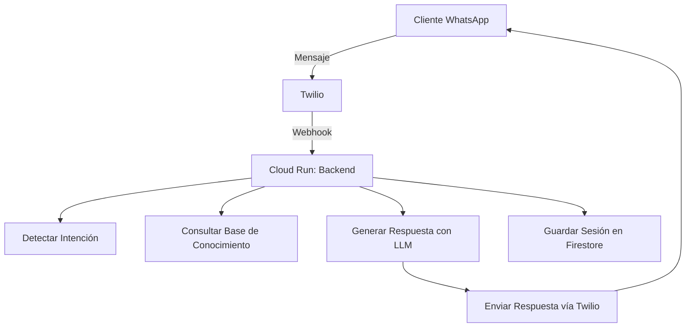

# 🤖 Agente de WhatsApp para Servicio al Cliente y Ventas


Un **agente de WhatsApp** que automatiza el **servicio al cliente y ventas**, respondiendo preguntas basadas en la descripción de tu empresa, productos y preguntas frecuentes (FAQ). Utiliza **Mistral API**, **OpenRouter API** o **Gemini API** para generar respuestas dinámicas y contextualizadas.

**✅ Desplegado en Google Cloud Platform (GCP) con un costo máximo de $50/mes.**

---

## 🎯 **Características**

- ✅ **Integración con WhatsApp** mediante Twilio.
- ✅ **Respuestas automáticas** basadas en base de conocimiento (empresa, productos, FAQ).
- ✅ **Generación de respuestas dinámicas** con modelos de lenguaje (LLM).
- ✅ **Manejo de contexto** en conversaciones (historial de mensajes).
- ✅ **Detección de intenciones** (saludos, consultas, compras, quejas).
- ✅ **Escalamiento a humanos** cuando el agente no puede responder.
- ✅ **Caching de respuestas** para reducir costos.
- ✅ **Monitoreo de costos** y uso de tokens.
- ✅ **Despliegue serverless** en Cloud Run (GCP).

---

## 📌 **Arquitectura**



**Componentes**:
- **Backend**: FastAPI en Cloud Run.
- **Base de Datos**: Firestore (modo Datastore).
- **LLM**: Mistral/OpenRouter/Gemini.
- **WhatsApp**: Twilio API.

---

## 🚀 **Requisitos Previos**

### **1. Cuentas y APIs**
- [Google Cloud Platform (GCP)](https://cloud.google.com/): Proyecto con facturación habilitada.
- [Twilio](https://www.twilio.com/): Cuenta con WhatsApp Sandbox habilitado.
- [Mistral API](https://mistral.ai/) / [OpenRouter API](https://openrouter.ai/) / [Gemini API](https://ai.google.dev/): API key para el LLM.

### **2. Herramientas Locales**
- Python 3.10+
- pip
- gcloud CLI (para despliegue en GCP)
- Docker (opcional, para pruebas locales)

---

## 📥 **Instalación**

### **1. Clonar el Repositorio**
```bash
git clone https://github.com/jmparejaz/agent-optimization-factory.git
cd agent-optimization-factory
```

### **2. Configurar el Entorno**

#### **Opción A: Usar `config.yaml` (recomendado)**
1. Copia el archivo de ejemplo:
   ```bash
   cp config.yaml.example config.yaml
   ```
2. Edita `config.yaml` con tus credenciales:
   ```yaml
   twilio:
     account_sid: "YOUR_TWILIO_ACCOUNT_SID"
     auth_token: "YOUR_TWILIO_AUTH_TOKEN"
     whatsapp_number: "whatsapp:+14155238886"
   
   gcp:
     project_id: "YOUR_GCP_PROJECT_ID"
     region: "us-central1"
   
   llm:
     model: "mistral-tiny"
     api_keys:
       mistral: "YOUR_MISTRAL_API_KEY"
   ```

#### **Opción B: Usar `.env` (alternativo)**
1. Copia el archivo de ejemplo:
   ```bash
   cp .env.example .env
   ```
2. Edita `.env` con tus credenciales:
   ```ini
   TWILIO_ACCOUNT_SID=your_twilio_account_sid
   TWILIO_AUTH_TOKEN=your_twilio_auth_token
   MISTRAL_API_KEY=your_mistral_api_key
   GOOGLE_CLOUD_PROJECT=your_gcp_project_id
   ```

### **3. Instalar Dependencias**
```bash
pip install -r requirements.txt
```

---

## 🏗️ **Configuración Inicial**

### **1. Habilitar Servicios de GCP**
```bash
# Autenticarse en GCP
gcloud auth login

# Habilitar servicios necesarios
gcloud services enable run.googleapis.com firestore.googleapis.com secretmanager.googleapis.com
```

### **2. Configurar Twilio**
1. Ve a [Twilio Console](https://console.twilio.com/) y habilita **WhatsApp Sandbox**.
2. Únete al sandbox enviando un mensaje al número de Twilio con el código de verificación.
3. Configura el webhook (se hará automáticamente al desplegar).

### **3. Inicializar Firestore**
Ejecuta el script para cargar la base de conocimiento:
```bash
python init_firestore.py --init
```

---

## 🚀 **Despliegue en GCP**

### **1. Construir y Desplegar**
Ejecuta el script de despliegue:
```bash
chmod +x .agents/scripts/deploy.sh
.agents/scripts/deploy.sh
```

Este script:
- Construye la imagen del contenedor con Cloud Build.
- Despliega el backend en Cloud Run.
- Configura variables de entorno.
- Actualiza `config.yaml` con la URL del webhook.

### **2. Configurar Webhook en Twilio**
1. Ve a [Twilio Console > Phone Numbers](https://console.twilio.com/us1/develop/phone-numbers/manage).
2. Selecciona tu número de WhatsApp.
3. En **"A MESSAGE COMES IN"**, configura:
   - **Webhook URL**: `https://<TU_SERVICIO>.a.run.app/webhook` (la URL se muestra al final del despliegue).
   - **HTTP Method**: `POST`.

---

## 🧪 **Pruebas**

### **1. Pruebas Locales con ngrok**
1. Inicia ngrok:
   ```bash
   ngrok http 8000
   ```
2. Ejecuta el backend localmente:
   ```bash
   uvicorn src.main:app --reload --port 8000
   ```
3. Configura el webhook en Twilio con la URL de ngrok (ej: `https://abc123.ngrok.io/webhook`).
4. Envía un mensaje de WhatsApp al número de Twilio y verifica la respuesta.

### **2. Pruebas en Producción**
1. Envía un mensaje de WhatsApp al número de Twilio.
2. Verifica que el agente responda correctamente.

### **3. Pruebas de Endpoints**
- **Health Check**: `GET /health`
  ```bash
  curl https://<TU_SERVICIO>.a.run.app/health
  ```
- **Prueba del LLM**: `POST /test/llm`
  ```bash
  curl -X POST https://<TU_SERVICIO>.a.run.app/test/llm \
    -H "Content-Type: application/json" \
    -d '{"prompt": "¿Qué productos tienen?"}'
  ```

---

## 📊 **Monitoreo**

### **1. Ver Logs en Tiempo Real**
```bash
chmod +x .agents/scripts/monitor.sh
.agents/scripts/monitor.sh
```

Selecciona la opción **2. Ver logs en tiempo real**.

### **2. Ver Métricas en GCP**
- [Cloud Logging](https://console.cloud.google.com/logs): Logs de todas las interacciones.
- [Cloud Monitoring](https://console.cloud.google.com/monitoring): Métricas de latencia, solicitudes, etc.
- [GCP Billing](https://console.cloud.google.com/billing): Costo en tiempo real.

### **3. Alertas de Costo**
El sistema está configurado para alertar si el costo supera **$40/mes** (configurable en `config.yaml`).

---

## 📂 **Estructura del Proyecto**

```bash
.
├── config.yaml                          # Configuración principal
├── .env.example                         # Ejemplo de variables de entorno
├── .gitignore                           # Archivos ignorados por Git
├── Dockerfile                           # Configuración del contenedor
├── init_firestore.py                    # Script para inicializar Firestore
├── requirements.txt                     # Dependencias de Python
├── README.md                            # Este archivo
├── src/
│   └── main.py                          # Backend principal (FastAPI)
└── .agents/
    ├── AGENTS.md                        # Documentación maestra
    ├── docs/
    │   ├── requirements.md               # Requisitos detallados
    │   └── gcp_architecture.md           # Arquitectura en GCP
    ├── plans/
    │   ├── master_plan.md                # Plan maestro
    │   └── architecture_diagram.md        # Diagramas de arquitectura
    ├── workflows/
    │   ├── whatsapp_webhook.md           # Flujo del webhook
    │   ├── llm_integration.md            # Integración con LLM
    │   └── customer_service.md            # Flujo de servicio al cliente
    ├── skills/
    │   ├── __init__.py
    │   ├── whatsapp_handler.py           # Manejo de WhatsApp
    │   ├── llm_client.py                 # Cliente de LLM
    │   ├── knowledge_base.py             # Base de conocimiento
    │   ├── response_generator.py         # Generador de respuestas
    │   ├── session_manager.py            # Manejo de sesiones
    │   └── utils/
    │       ├── __init__.py
    │       ├── config.py                 # Configuración
    │       └── logging.py                # Logging
    └── scripts/
        ├── deploy.sh                     # Despliegue en Cloud Run
        └── monitor.sh                    # Monitoreo
```

---

## 🔧 **Personalización**

### **1. Base de Conocimiento**
Edita `config.yaml` para personalizar:
- **Información de la empresa**: Nombre, descripción, misión, visión.
- **Productos**: Lista de productos con nombre, descripción, precio, características.
- **FAQ**: Preguntas y respuestas frecuentes.

Ejemplo:
```yaml
knowledge_base:
  company:
    name: "Mi Empresa"
    description: "Somos una empresa dedicada a ofrecer productos innovadores."
    mission: "Ofrecer soluciones prácticas y de alta calidad."
    vision: "Ser líderes en el mercado."
  
  products:
    - name: "Producto 1"
      description: "Un producto revolucionario para el hogar."
      price: 100
      features: ["Duradero", "Fácil de usar"]
      stock: true
      category: "hogar"
  
  faq:
    - question: "¿Ofrecen garantía?"
      answer: "Sí, todos nuestros productos tienen garantía de 1 año."
```

### **2. Modelo de LLM**
Cambia el modelo en `config.yaml`:
```yaml
llm:
  model: "mistral-tiny"  # Opciones: mistral-tiny, mistral-small, openrouter:mistralai/mistral-tiny, gemini-1.0-pro
  api_keys:
    mistral: "YOUR_MISTRAL_API_KEY"
    openrouter: "YOUR_OPENROUTER_API_KEY"
    gemini: "YOUR_GEMINI_API_KEY"
  temperature: 0.7       # Creatividad (0 = determinista, 1 = aleatorio)
  max_tokens: 200        # Máximo de tokens por respuesta
```

### **3. Parámetros de Despliegue**
Ajusta la configuración de Cloud Run en `config.yaml`:
```yaml
gcp:
  cloud_run:
    service_name: "whatsapp-agent-backend"
    memory: "2Gi"        # Memoria (ej: 2Gi, 4Gi)
    cpu: "1"            # Número de CPUs
    max_instances: 1     # Máximo de instancias (para controlar costos)
    timeout: 300         # Timeout en segundos
```

---

## 💰 **Costos Estimados**

| **Servicio**       | **Uso Estimado**               | **Costo (USD/mes)** | **Notas**                                  |
|--------------------|--------------------------------|--------------------|--------------------------------------------|
| Cloud Run          | 1 vCPU, 2GB RAM, 1 instancia    | ~$25-$30           | Ejecución bajo demanda.                     |
| Firestore          | 10K operaciones, 1GB almacenamiento | ~$5-$10        | Modo Datastore (económico).                 |
| Twilio             | 3K mensajes (100 usuarios/día) | ~$15               | $0.005 por mensaje.                        |
| Mistral API        | 10K tokens                      | ~$5                | `mistral-tiny` (0.00000025/token input, 0.0000005/token output). |
| **Total**          |                                | **~$44-$50**       | ✅ Dentro del presupuesto.                   |

**Optimizaciones**:
- **Caching**: Respuestas frecuentes guardadas en Firestore.
- **Límites**: Máximo 200 tokens por respuesta.
- **Escalado**: 1 instancia máxima en Cloud Run.

---

## 📅 **Hoja de Ruta (Roadmap)**

| **Fase** | **Objetivo**                          | **Estado**      | **Fecha Estimada** |
|----------|--------------------------------------|-----------------|--------------------|
| 1        | Configuración inicial (GCP, Twilio)  | ✅ Completado   | 2024-10-01         |
| 2        | Despliegue del backend               | ⏳ En progreso   | 2024-10-02         |
| 3        | Pruebas con usuarios reales           | ⏳ Pendiente     | 2024-10-03         |
| 4        | Optimización de costos               | ⏳ Pendiente     | 2024-10-04         |
| 5        | Documentación final                  | ⏳ Pendiente     | 2024-10-05         |

---

## 🤝 **Contribuciones**

Las contribuciones son bienvenidas. Para contribuir:
1. Haz un **fork** del repositorio.
2. Crea una **rama** (`git checkout -b feature/nueva-funcionalidad`).
3. Haz **commit** de tus cambios (`git commit -m "Añade nueva funcionalidad"`).
4. Abre un **Pull Request**.

---

## 📄 **Licencia**

Este proyecto está bajo la licencia **MIT**. Consulta el archivo [LICENSE](LICENSE) para más detalles.

---

## 📞 **Soporte**

- **Issues**: [GitHub Issues](https://github.com/jmparejaz/agent-optimization-factory/issues)
- **Discusiones**: [GitHub Discussions](https://github.com/jmparejaz/agent-optimization-factory/discussions)
- **Contacto**: jmparejaz (propietario del repositorio)

---

## 🏆 **Agradecimientos**

- [FastAPI](https://fastapi.tiangolo.com/): Framework para el backend.
- [Twilio](https://www.twilio.com/): API de WhatsApp.
- [Mistral AI](https://mistral.ai/): Modelo de lenguaje económico.
- [Google Cloud Platform](https://cloud.google.com/): Infraestructura en la nube.

---

**¡Gracias por usar este proyecto!** 🚀
